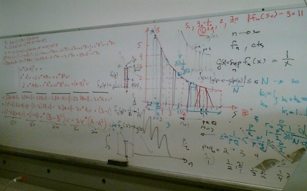

**Welcome to MA321!** So what's this class about?

The name of this course is a bit mysterious - more appropriately, it would be called "Analysis" or even "Real analysis", using the standard mathematical language. The aim of this course is both to further solidify your proof-writing skills (that you started to build in MA211), and to give rigorous foundation to concepts of derivatives and integrals (which is why it is officially called "Advanced Calculus").

"**Analysis**" in mathematics refers to a type of study that deals with concepts of limits, infinitely small (infinitesimal) and infinitely large (simply... infinite) quantities. Real analysis therefore deals with those concepts as they relate to real numbers. There are other types of analyses: complex, functional, harmonic, etc. Many of these topics build on the concepts we will cover in this class.

On the other hand "**calculus**" by itself means "system of calculation". So there are such things as "matrix calculus", "calculus of variations", "operator calculus", etc. The "Calculus" as you encountered it in your previous classes is more properly called "Infinitesimal calculus", as it deals with calculating properties of functions based on tiny changes in their arguments.

{: style="float: left;margin: 15px;" width="35%"} OK, so now that we realized that our class should really be called **"Advanced inifinitesimal calculus"**, we can ask -- in what way is it "Advanced"? Well, in your Calc I-III you concerned yourself mostly with rules of calculation, memorizing them, applying them to increasingly complicated functions, and finding use for them in various modeling problems. In this class we tackle the important questions of *Why THESE rules work?* For most part, this class will feel nothing like Calculus I-III, it will feel mostly like trying to learn a new language (programming or spoken). We will rarely deal with specific numbers or functions, rather focusing on entire classes and families of them. Occasionally, we'll encounter surprising objects like the [Thomae's function](https://en.wikipedia.org/wiki/Thomae%27s_function), shown in the figure, that is discontinuous on rational numbers, but continuous on real numbers. (Weird, right?)

{: style="float: right;margin: 15px;" width="35%"}As important as content of our investigations will be the process. This is a **proof-based class**, which means we'll strive to provide as mathematically and logically rigorous arguments for our conclusions. Even if you never end up working in real, or any other analysis, this class will sharpen your idea for identifying things that need to be proven, and formulating questions that demand proofs as answers.

At this point, you may start grasping the nature of our quest this semester. But every quest should have some kind of a holy grail at the end. **Our grail will be the Theorem of existence and uniqueness of solutions of the ODEs.** This is the Theorem that actually describes those ODEs that have solutions! The usual differential equations courses for undergrads just brush the question aside, but the theorem beautifully integrates (no pun intended) all the topics we will cover in this class. Theorem of this type are additionally the hallmark of analysis. To boot, [theorem of this sort for Navier--Stokes PDE is worth $1 mil.](http://theconversation.com/millennium-prize-the-navier-stokes-existence-and-uniqueness-problem-4244). Perhaps this is your first step toward claiming that prize **and mathematical glory**.

---


