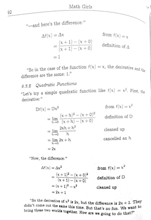

{::options toc_levels="1..2" /}

1. TOC
{: toc style="font-size:10pt; column-count:3; column-width: 20px; column-gap: 20px;" }

For every topic below, I will choose several questions, prompts, definitions, etc. that you either have to find in the listed chapter or answer on your own. My goal here is not to ask anything too difficult, but rather focus your reading.

I will regularly check if you're maintaining your journal. At beginning of each class meeting, you will submit answers to the prompts on one (preferrably) sheet of three-hole punched paper. After I check that you completed your work, I'll return the sheet to you. Then you will put the sheet into your 3-hole binder to serve as a reference for the rest of the semester.

Journal entries should contain:
- summary of the reading
- answers to questions
- any musings/thoughts/questions about the material read

## Week 1
### Mon  -- Sep 2	-- Math Girls, Syllabus, Motivation articles

- Read [the syllabus](./syllabus.html)
- Read [the article on Navier--Stokes equations](https://theconversation.com/millennium-prize-the-navier-stokes-existence-and-uniqueness-problem-4244). Optionally, you can [read this one as well](https://www.quantamagazine.org/mathematicians-find-wrinkle-in-famed-fluid-equations-20171221/).
- Explain: what does "existence of solutions" refer to?
- What are "harmonic numbers"and what is the "harmonic series"?
- What does "real analysis" mean?

### Wed  -- Sep 4	-- Lebl 0.3 - Basic set theory + TBB, Appendix A.

- What is the "set-building notation"? Give an example that uses it that's not given in the reading for the class.
- What proving technique (direct, contraposition, contradiction,...) is used to construct the proof for Theorem 0.36. Review proving techniques from your MA211 notes, TBB readings, or [supplementary material for this course](https://mbudisic.github.io/MA321-Clarkson-F19/syllabus.html#additional-resources), e.g., *How to Solve It*, *How to Prove It*.
- Sketch a Venn diagram that demonstrates two DeMorgan rules.
- Given the statement "Every prime number larger than 2 is odd", write its:
  - contrapositive statement
  - contradictory statement (negation)
- Explain the difference between "induction" and "strong inducation" principles.

### Fri  -- Sep 6	-- Lebl 0.3 Functions and cardinality + TBB, Appendix A

- The textbook statesthat a definite integral $$\int_0^1 g(x) dx$$ can be interpreted as a function, having (some other) functions as inputs, and scalars as outputs. What is the domain of this "definite integral" function, and what is its range?
- Books sometimes mention the term "codomain". Look up the definition (say in Wikipedia or in readings) and explain how this is different than "range".
- For function $$f(x) = x^2$$, where $$x\in\mathbb{R}$$, give:
  - domain
  - range
  - direct images of  $$I_1=(-\infty,0)$$, $$I_2=(-\infty,\infty)$$,
  - inverse image (or preimage) of $$S_1 = \{0\}$$, $$S_2 = \{1\}$$, $$S_3 = \{-1\}$$
- After reading through Example 0.3.25, explain why the following calculation is unambiguous: 
$$\frac{1}{2} + \frac{2}{3}= \frac{3}{6} + \frac{4}{6} = \frac{7}{6}$$.
- What is the difference between a "proper subset" and just "subset"?
- Give an example of a countably-infinite set, and an uncountably-infinite sets. Come up with examples that were not given in the book.

## Week 2
### Mon  -- Sep 9	-- 1.1 Basic properties of real numbers -- Order, supremum, infimum

- Example 1.2.3. (from next section) shows that $$\sqrt{2} \in \mathbb{R}$$ and that it's a unique number. Do you know a simpler proof that $$\sqrt{2} \not \in \mathbb{Q}$$? If you do, write it out.
- Write out definitions:
  - Lower bound
  - Infimum
  - Completeness (or least-upper-bound property)
- Prove that if supremum (or infimum) exist, they are necessarily unique. [If you're a careful reader, you can find it in the text.]
- Notice how much of this section is about inequalities. (Just notice and ponder what this means for the rest of this class.)
- Example 1.1.10 states that $$\mathbb{C}$$ can be ordered, and that it's also a field. But it's not an *ordered field*. Explain the technical/definitional reason for this (that is: what makes a field that is also *ordered set* into an *ordered field*).

### Wed  -- Sep 11	-- 1.2. Set of real numbers - Density

- In the proof of Prop. 1.2.2 there is a "why?" moment. Answer "why".
- What is meant by "(ordered) set A is dense in set B"? Is (a) $$\mathbb{R}$$ dense in $$\mathbb{R}$$, (b) (a) $$\mathbb{N}$$ dense in $$\mathbb{N}$$, (a) $$\mathbb{Q}$$ dense in $$\mathbb{R}$$?
- Explain "Archimedean property" in words.

### Fri  -- Sep 13	-- 1.2. Set of real numbers - Suprema, infima, inequalities

- Explain the difference between *infimum* and *minimum* of a set. Give an example of a set for which only one (infimum or minimum) exist.
- Find the part of the book that says that if $$\forall x \in A, \forall y \in B$$ it holds $$x < y$$ implies only $$\sup A \leq \inf B$$ and **not** a strict inequality. Give an example of this that is *not* already in the book.
- Attempt to prove AM-GM (Arithmetic Mean-Geometric Mean) inequality.

## Week 3

### Mon  -- Sep 16	-- 1.2 Suprema and infima

No additional reading or questions. Read through exercises 1.2.9-1.2.17. and perhaps attempt to prove some (all?) of them. Record your impressions and observations.

### Wed  -- Sep 18	-- 1.3 Absolute value and boundedness

- Calculate $$\vert 10 \vert$$ and $$\vert -12 \vert$$ by using the definition of absolute value.
- Use the triangle inequality to provide an upper bound on $$\vert x^2 - 3x + 4 \vert$$ on $$-2 \leq x \leq 6$$ not using any calculators/computers.
- Solve Exercise 1.3.2.

### Fri -- Sep 20 -- Problem work

Today we'll work on some problems from past homeworks/journals/sections to jump-start studying for the Midterm.

Your journal task is to go over (some/most/all - up to you) past problems (homeworks and classwork) and record your first thoughts about what strategy should be pursued for each individual problem (regardless of whether you solved the problem originally or not).

You don't have to turn anything in for this day (the sheet is to help you study during the weekend so do as much or as little as you think you need).

## Week 4

### Mon -- Sep 23 -- No Journal Assignment (to allow for studying)

### Wed -- Sep 25 -- Midterm (therefore no Journal)

### Fri -- Sep 27 -- Sequences 

For Friday, read up to (and including) 2.1.1 - Monotone sequences.

First, I draw your attention to the footnote on the first page of Chapter 2. I would prefer if we used the notation $$(x_n)$$ for sequences, reserving $$\{ x_n \}$$ for sets. The main difference comes from sets (typically) not having repeating elements (see: [Multiset](https://en.wikipedia.org/wiki/Multiset) ), while sequences could definitely have repeated elements.

Now for questions:
{: style="float: right;margin: 15px;" width="35%"}

- Write out what $$x^\ast = \lim_n x_n$$ implies (there are two concepts implied by this notation).
- Copy the proof to Prop 2.1.6 as a sequence of two-column line-by-line statement. You should put every new mathematical statement/implication on its own line in the LEFT column, and in the RIGHT column write out why this line follows/where it originates - kind of like *Math Girls* presents proofs (see - I'm using the book!). You'll likely use definition of the limit, triangle inequality, definition of absolute value... 
- Read this [Devlin's angle column](https://www.mathvalues.org/masterblog/what-is-a-mathematical-proof) and answer: "What is the key property of a mathematical proof?" in [Dr. Devlin's](https://web.stanford.edu/~kdevlin/) opinion?
- Example 2.1.11 has a "why is this true?" moment. Fill in the details.
- What's the point of Example 2.1.12.?
- Notice that showing convergence Ex.2.1.8. starts with a "good" candidate for the limit, while Ex 2.1.11. proves that the sequence is convergent *before* starting to talk about the limit (The limit discussion begins with "We already know..."). Propose how you would structure the proof for convergence of Ex.2.1.8 using Sec 2.1.1. knowledge, without having any candidates for a limit. You may want to visualize the sequence using this [Desmos applet for inspiration](https://www.desmos.com/calculator/kje5fbagfc). (You don't need to provide all details of the proof - just that initial idea "I'd prove this first, and then prove that second, and that should be enough."

## Week 5

### Mon -- Sep 30 -- Sequences continued

Read the remainder of Sec 2.1. from the textbook.

- Prove the convergence and compute the limit of either one of the three sequences from Friday's handout (available on Moodle in PDF).
- Prove (by induction) that $$x_n = \frac{n^2+1}{n^2 + n}$$ has a $$K$$-tail that is monotonically increasing. (And determine the smallest value of $$K \in \mathbb{N}$$ for which this holds true.
- Proof to Prop. 2.1.15 starts with "It's clear." Give the details behind this statement.
- The Proof to Prop. 2.1.15 contains a cycle of implications. This is **extremely** common way of proving that a set of statements are equivalent to each other.
- Give details for the "It's not hard to prove" part of Proof 2.1.17
- Copy Prop 2.3.7 that is "forward referred" to in the end of the section.

### Wed -- Oct 2 -- Facts about sequences

Sections 2.2.1 and 2.2.2

1. What's the common use for the *Squeeze lemma*? Give an example.
1. What's the common source of errors concerning inequalities and limits? Give an example.
1. Copy the proof for 2.2.5 (iii) and format is as a "Math Girls"-style proof, where you justify each line.
1. Use Prop 2.2.5 and induction to show that $$\lim x_n^k = (\lim x_n)^k$$.

### Fri -- Oct 4 -- Facts about sequences

Sections 2.2.3 and 2.2.4 

1. Observe the use of monotone + decreasing to establish convergence of Newton's iteration for $$\sqrt{2}$$ but a completely different way to actually evaluate the limit.
1. Try to recover the intuition behind choosing the particular sequence $$n/(1+\varepsilon)^n$$ in proof of Example 2.2.14. (otherwise it just pops out of nowhere)
1. Create a "sequences cheat sheet" -- list of all important properties and propositions that you have learned about sequences. The goal is not to copy *everything* but try to identify the critical information in Sec 2.1 and 2.2

## Week 6

### Mon -- Oct 7 -- Limit superior/inferior

We studied subsequences of sequences. For bounded sequences, there are particularly *distinguished* subsequences. This section is about how to use their properties to describe properties of the primary (full) sequence.

  1. Write out definitions of $$\limsup$$ and $$\liminf$$
  1. Make a sketch of your own that illustrates lim inf/lim sup -- basically make a sketch/copy of Figure 2.5, while understanding what each object on that Figure is
  1. Theorem 2.3.4 is important. Let's name it "Real-line BW":
    - answer the "why?" question in its proof.
    - why did the author choose to make the $$a_{n_k}$$ less than $$\varepsilon/2$$ (and not just $$\varepsilon$$). Discuss what would happen if we just proceeded with $$\varepsilon$$... how would the proof end? Would it be correct?
  1. Copy the sentence and fill the blank:

"$$\limsup$$ and $$\liminf$$ are ...... subsequential limits."

### Wed -- Oct 9 -- Bolzano--Weierstrass, Cauchy sequences

  Bolzano--Weierstrass:
  
  1. Explain why the author states B--W theorem as different than Theorem 2.3.4
  1. In the context of your previous answer, compare proof of Theorem 2.3.4 with the proof of B--W -- notice that BW proof does not use any numbers external to the sequence, while 2.3.4 uses $$1/(k+1)$$
  1. How is the statement "$$\lim x_n = \infty$$" different from a statement "$$x_n$$ diverges"?

  Cauchy sequences:

  1. What does "being Cauchy" mean intuitively?
  1. Show that $$n^2/(n^2+1)$$ is a Cauchy sequence.

### Fri -- Oct 11 -- Cauchy Sequences, Introduction to series

  Cauchy sequences:
  
  1. Try to prove (without looking into the book) that "If a sequence is convergent, it is Cauchy" (this is the forward direction of Thm. 2.4.5). Leave your personal proof in the journal (even if you find that it's incorrect when you compare with the book) --- there's no shame here - you're learning!
  1. Copy statements of Prop. 2.3.5 and Prop. 2.3.7.
  1. What does it mean that "Set $$\mathbb{R}$$ is Cauchy complete"?

  Series (2.5.1 and 2.5.2): 

  1. What are two meanings of notation $$\sum_k x_k$$?
  1. What's a possible mistake that notation $$\sum_k x_k = x_1 + x_2 + \dots$$ can make in concluding the result $$\sum_{k=1}^\infty (-1)^k$$. (write the sequence of partial sums explicitly to conclude if the series converges)
  1. What is the *geometric series*? State formula for its partial sums. Would you know how to prove the formula is true?
  

## Week 7

### Wed -- Oct 16 -- Series (Section 2.5 in Lebl)

  1. Re-read Chapter 8 in Math Girls. Perhaps now that you're knee-deep in sequences and series, you'll find little gems in that chapter. (If you do, report them in your journal.)
  1. If $$\sum x_n$$ converges, what does it say about sequence $$x_n$$?
  1. If $$\sum \vert x_n \vert$$ converges, what all good properties does $$\sum x_n$$ enjoy (there's more than one)?
  1. Is $$(\sum_n x_n) \times (\sum_n y_n) = \sum_n (x_n y_n)$$?
  1. What is the Riemann zeta function?
  1. Think about how comparison test and $$p$$-test may be employed together.
  1. State the ratio test.
  
### Fri -- Oct 18 -- Series (Section 2.5 in Lebl)

If you have completed the journal for Wed, there is nothing new to submit. To prepare for class:

  - work on the Homework
  - review convergence tests for series

## End
